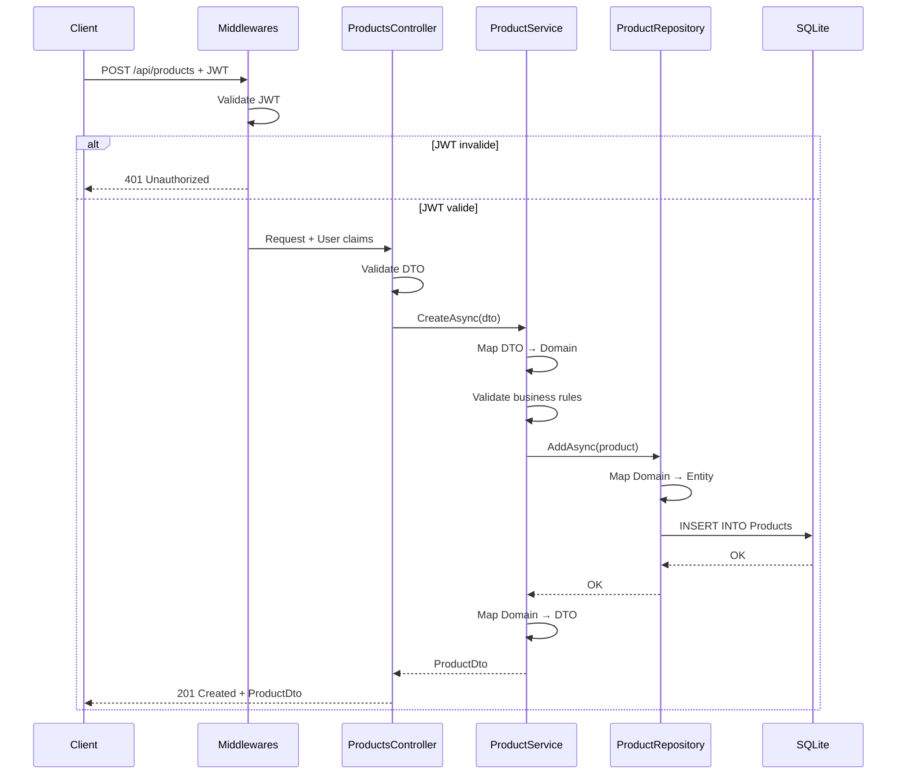

# 04 - Fonctionnement

## 🔄 Flow d'une requête HTTP

### Exemple : Créer un produit

```
┌─────────┐     ┌────────────┐     ┌──────────┐     ┌────────────┐     ┌──────────┐
│ Client  │────→│Middlewares │────→│Controller│────→│  Service   │────→│Repository│
└─────────┘     └────────────┘     └──────────┘     └────────────┘     └──────────┘
    ↓                 ↓                   ↓                ↓                   ↓
  POST         1. HTTPS Redirect    3. Validate     5. Map DTO      7. Save to DB
/api/products  2. JWT Auth          4. Call Service    to Domain    8. Map to Entity
               3. Authorization                     6. Business     9. EF Core
                                                       Logic
```

### Détail étape par étape

#### 1️⃣ **Client envoie la requête**

```http
POST /api/products HTTP/1.1
Host: localhost:5155
Authorization: Bearer eyJhbGci...
Content-Type: application/json

{
  "name": "Laptop",
  "priceHT": 1000,
  "tvaType": "Standard"
}
```

#### 2️⃣ **Middlewares** (`UseAppMiddlewares()`)

```csharp
// 1. UseHttpsRedirection() → Force HTTPS
// 2. UseAuthentication() → Valide le token JWT
// 3. UseAuthorization() → Vérifie les permissions
```

**Si le token est invalide** → 401 Unauthorized  
**Si le token est valide** → Continue

#### 3️⃣ **Controller** (`ProductsController`)

```csharp
[HttpPost]
[Authorize]
public async Task<IActionResult> Create([FromBody] CreateProductDto dto)
{
    // Validation des données (automatic model validation)
    if (!ModelState.IsValid)
        return BadRequest(ModelState);
    
    // Appel du service
    var product = await _productService.CreateAsync(dto);
    
    // Retour HTTP 201 Created
    return CreatedAtAction(nameof(GetById), 
        new { id = product.Id }, 
        product);
}
```

#### 4️⃣ **Service** (`ProductService`)

```csharp
public async Task<ProductDto> CreateAsync(CreateProductDto dto)
{
    // 1. Mapping DTO → Domain
    var price = new Price(dto.PriceHT, dto.TvaType);
    var product = new Product(dto.Name, price);
    
    // 2. Validation métier (dans Product)
    // → Product.ctor valide que name != empty et price > 0
    
    // 3. Appel du repository
    await _repository.AddAsync(product);
    
    // 4. Mapping Domain → DTO
    return product.ToDto();
}
```

#### 5️⃣ **Repository** (`ProductRepository`)

```csharp
public async Task AddAsync(Product product)
{
    // 1. Mapping Domain → Entity (pour EF Core)
    var entity = MapToEntity(product);
    
    // 2. Ajout dans le DbContext
    await _context.Products.AddAsync(entity);
    
    // 3. SaveChanges (commit en DB)
    await _context.SaveChangesAsync();
}
```

#### 6️⃣ **Base de données SQLite**

```sql
INSERT INTO Products (Id, Name, PriceHT, TvaType, IsActive)
VALUES ('3fa85f64-...', 'Laptop', 1000.00, 2, 1);
```

#### 7️⃣ **Réponse au client**

```http
HTTP/1.1 201 Created
Location: /api/products/3fa85f64-...
Content-Type: application/json

{
  "id": "3fa85f64-...",
  "name": "Laptop",
  "priceHT": 1000.00,
  "priceTTC": 1200.00,
  "tvaType": "Standard",
  "isActive": true
}
```

---

## 🔐 Flow d'authentification JWT

### 1. Login

```
┌──────┐     ┌──────────────┐     ┌─────────────┐     ┌────────────┐
│Client│────→│AuthController│────→│TokenService │────→│  Response  │
└──────┘     └──────────────┘     └─────────────┘     └────────────┘
   ↓                ↓                     ↓                   ↓
POST           1. Validate          3. Generate         5. Return
/api/auth/login   username +           JWT token          token +
                  password                                expiresAt
{                2. Check           4. Sign with
 "username":       credentials        secret key
 "password":       (hardcoded:
}                  admin/password)
```

**Code :**

```csharp
// AuthController.cs
[HttpPost("login")]
[AllowAnonymous]
public IActionResult Login([FromBody] LoginRequest request)
{
    // Validation (pour ce démo : admin/password)
    if (request.Username != "admin" || request.Password != "password")
        return Unauthorized();
    
    // Génération du token
    var token = _tokenService.GenerateToken(request.Username, "Admin");
    var expiresAt = DateTime.UtcNow.AddMinutes(60);
    
    return Ok(new LoginResponse(token, expiresAt));
}
```

### 2. Utilisation du token

```
Client → [Authorization: Bearer <token>] → Middleware → Validation → Continue
```

**Validation JWT :**
1. Vérifier la **signature** (avec la clé secrète)
2. Vérifier l'**expiration** (claim `exp`)
3. Vérifier l'**issuer** et l'**audience**
4. Extraire les **claims** (username, role)

**Si valide** → Claims disponibles dans `HttpContext.User`  
**Si invalide/expiré** → 401 Unauthorized

---

## 🗄️ Mapping des couches

### Domain ↔ Entity (Infrastructure)

```csharp
// ProductRepository.cs

// Domain → Entity (pour sauvegarder)
private ProductEntity MapToEntity(Product product)
{
    return new ProductEntity
    {
        Id = product.Id,
        Name = product.Name,
        PriceHT = product.Price.GetAmountHt(),
        TvaType = product.Price.GetTvaType(),
        IsActive = product.GetIsActive()
    };
}

// Entity → Domain (pour récupérer)
private Product MapToDomain(ProductEntity entity)
{
    var price = new Price(entity.PriceHT, entity.TvaType);
    return Product.Reconstitute(
        entity.Id,
        entity.Name,
        price,
        entity.IsActive,
        null // suppliers
    );
}
```

### Domain ↔ DTO (Application)

```csharp
// ProductMappings.cs

// Domain → DTO (pour l'API)
public static ProductDto ToDto(this Product product)
{
    return new ProductDto
    {
        Id = product.Id,
        Name = product.Name,
        PriceHT = product.Price.GetAmountHt(),
        PriceTTC = product.Price.GetAmountTtc(),
        TvaType = product.Price.GetTvaType().ToString(),
        IsActive = product.GetIsActive()
    };
}

// DTO → Domain (depuis l'API)
public static Product ToDomain(this CreateProductDto dto)
{
    var price = new Price(dto.PriceHT, dto.TvaType);
    return new Product(dto.Name, price);
}
```

---

## 🧪 Flow des tests

### Tests unitaires (Domain)

```csharp
[Fact]
public void Constructor_WithValidData_ShouldCreateProduct()
{
    // Arrange
    var price = new Price(100m, TvaType.Standard);
    
    // Act
    var product = new Product("Laptop", price);
    
    // Assert
    product.Name.Should().Be("Laptop");
    product.Price.GetAmountHt().Should().Be(100m);
    product.GetIsActive().Should().BeTrue();
}
```

**Pas de base de données, pas de HTTP, juste la logique métier !**

### Tests d'intégration (Infrastructure)

```csharp
[Fact]
public async Task AddAsync_ShouldPersistProduct()
{
    // Arrange
    var product = new Product("Laptop", new Price(100m, TvaType.Standard));
    var repository = new ProductRepository(Context); // SQLite in-memory
    
    // Act
    await repository.AddAsync(product);
    var result = await repository.GetByIdAsync(product.Id);
    
    // Assert
    result.Should().NotBeNull();
    result.Name.Should().Be("Laptop");
}
```

**Vraie base de données (SQLite en mémoire), vraie persistence, vrais tests SQL !**

---

## 📊 Diagramme de séquence - Créer un produit



---

## 🔄 Cycle de vie des objets (DI)

### Scoped (par requête HTTP)

```csharp
builder.Services.AddScoped<ProductService>();
builder.Services.AddScoped<IProductRepository, ProductRepository>();
```

**Durée de vie :**
- Créé au début de la requête HTTP
- Réutilisé pendant toute la requête
- Détruit à la fin de la requête

**Idéal pour :**
- Services applicatifs
- Repositories
- DbContext

### Singleton (toute la vie de l'app)

```csharp
builder.Services.AddSingleton<ITokenService, TokenService>();
```

**Durée de vie :**
- Créé au démarrage de l'application
- Une seule instance pour toute l'app
- Jamais détruit (sauf arrêt de l'app)

**Idéal pour :**
- Configuration
- Cache
- Services stateless

### Transient (à chaque injection)

```csharp
builder.Services.AddTransient<MyService>();
```

**Durée de vie :**
- Créé à chaque injection
- Plusieurs instances possibles dans une même requête
- Détruit rapidement

**Idéal pour :**
- Services légers
- Services stateless sans état partagé

---

## 🎯 Points clés

### Séparation des responsabilités

- **Controller** : HTTP, validation, routing
- **Service** : Logique applicative, orchestration
- **Repository** : Persistence, SQL
- **Domain** : Règles métier, invariants

### Immuabilité

- **Value Objects** sont immuables (`Price`)
- **DTOs** sont des records (immuables par défaut)
- Seules les **Entities** ont des méthodes de modification

### Validation

- **Controller** : Validation des données d'entrée (ModelState)
- **Domain** : Validation des règles métier (invariants)
- **Service** : Coordination, pas de validation directe

---

**Prochaine section** : [05 - Procédures](05-procedures.md)
