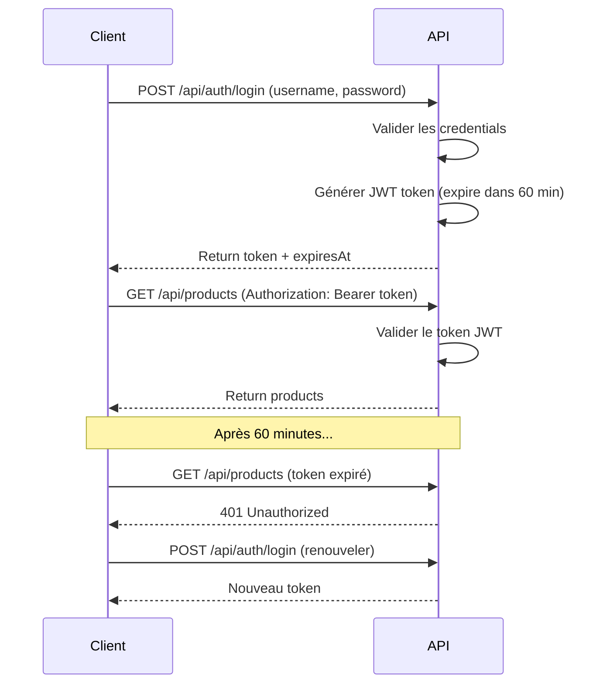

# 🔐 Authentification JWT - Guide

## 🎯 Vue d'ensemble

L'API est maintenant protégée par JWT (JSON Web Tokens). Tous les endpoints `/api/products` et `/api/suppliers` nécessitent un token valide.

---

## ⏱️ Délai d'expiration

**Durée de validité du token : 60 minutes (1 heure)**

Configuré dans `appsettings.json` :
```json
"Jwt": {
  "ExpirationInMinutes": 60
}
```

---

## 🔑 Comment obtenir un token JWT

### 1. Endpoint de login

**URL :** `POST /api/auth/login`

**Body (JSON) :**
```json
{
  "username": "admin",
  "password": "password"
}
```

**Réponse (200 OK) :**
```json
{
  "token": "eyJhbGciOiJIUzI1NiIsInR5cCI6IkpXVCJ9...",
  "expiresAt": "2026-02-13T15:30:00Z"
}
```

### 2. Exemple avec cURL

```bash
curl -X POST http://localhost:5155/api/auth/login \
  -H "Content-Type: application/json" \
  -d '{"username":"admin","password":"password"}'
```

### 3. Exemple avec Scalar UI

1. Ouvrir http://localhost:5155/scalar/v1
2. Aller sur `POST /api/auth/login`
3. Cliquer sur "Try it out"
4. Entrer :
   ```json
   {
     "username": "admin",
     "password": "password"
   }
   ```
5. Cliquer sur "Send Request"
6. **Copier le token** de la réponse

---

## 🛡️ Utiliser le token JWT

### Avec cURL

```bash
# 1. Récupérer le token
TOKEN=$(curl -s -X POST http://localhost:5155/api/auth/login \
  -H "Content-Type: application/json" \
  -d '{"username":"admin","password":"password"}' \
  | jq -r '.token')

# 2. Utiliser le token pour appeler un endpoint protégé
curl -X GET http://localhost:5155/api/products \
  -H "Authorization: Bearer $TOKEN"
```

### Avec Scalar UI

1. **Obtenir le token** via `/api/auth/login`
2. **Cliquer sur le bouton "Authorize"** (🔓 en haut à droite)
3. **Coller le token** dans le champ
4. **Cliquer sur "Authorize"**
5. Tous les appels suivants incluront automatiquement le token !

### Avec Postman

1. Onglet "Authorization"
2. Type : **Bearer Token**
3. Token : `<coller-votre-token-ici>`

---

## 🔄 Renouveler un token expiré

### Quand le token expire

Après 60 minutes, le token n'est plus valide. Vous recevrez :

**Erreur 401 Unauthorized :**
```json
{
  "type": "https://tools.ietf.org/html/rfc7235#section-3.1",
  "title": "Unauthorized",
  "status": 401
}
```

### Solution : Générer un nouveau token

Refaire un appel à `/api/auth/login` :

```bash
# Générer un nouveau token
curl -X POST http://localhost:5155/api/auth/login \
  -H "Content-Type: application/json" \
  -d '{"username":"admin","password":"password"}'
```

---

## 🧪 Tester l'authentification

### Endpoint de test : `/api/auth/me`

Vérifie que votre token est valide et affiche vos informations :

```bash
curl -X GET http://localhost:5155/api/auth/me \
  -H "Authorization: Bearer $TOKEN"
```

**Réponse :**
```json
{
  "username": "admin",
  "role": "Admin",
  "claims": [
    { "type": "http://schemas.xmlsoap.org/ws/2005/05/identity/claims/name", "value": "admin" },
    { "type": "http://schemas.microsoft.com/ws/2008/06/identity/claims/role", "value": "Admin" },
    { "type": "jti", "value": "..." },
    { "type": "iat", "value": "..." }
  ]
}
```

---

## 📋 Flux complet



---

## 🔒 Endpoints protégés

Tous ces endpoints nécessitent un token valide :

### Products
- `GET /api/products`
- `GET /api/products/{id}`
- `POST /api/products`
- `PUT /api/products/{id}`
- `DELETE /api/products/{id}`
- `PATCH /api/products/{id}/activate`
- `PATCH /api/products/{id}/deactivate`

### Suppliers
- `GET /api/suppliers`
- `GET /api/suppliers/{id}`
- `POST /api/suppliers`
- `PUT /api/suppliers/{id}`
- `DELETE /api/suppliers/{id}`

### Endpoints publics (pas de token requis)
- `POST /api/auth/login` ✅ Public

---

## ⚙️ Configuration

### Modifier le délai d'expiration

Dans `appsettings.json` :

```json
{
  "Jwt": {
    "ExpirationInMinutes": 120  // 2 heures
  }
}
```

### Modifier la clé secrète (IMPORTANT en production !)

**⚠️ En production, utiliser une variable d'environnement :**

```bash
export Jwt__SecretKey="VotreCleSecreteTresLongueEtAleatoire256Bits!!"
```

**Ou dans `appsettings.Production.json` :**
```json
{
  "Jwt": {
    "SecretKey": "${JWT_SECRET_KEY}"  // Depuis env var
  }
}
```

---

## 🎭 Comptes de test

Pour ce démo, un seul compte est configuré :

| Username | Password | Rôle  |
|----------|----------|-------|
| `admin`  | `password` | Admin |

**⚠️ En production :**
- Utiliser une vraie base de données d'utilisateurs
- Hasher les mots de passe (bcrypt, argon2)
- Implémenter l'inscription d'utilisateurs
- Gérer les rôles avec une table dédiée

---

## 🛠️ Développement

### Désactiver temporairement l'authentification

Commenter `[Authorize]` sur les contrôleurs :

```csharp
[ApiController]
[Route("api/[controller]")]
// [Authorize]  // ⬅️ Commenté
public class ProductsController : ControllerBase
```

### Vérifier le token localement

Utiliser [jwt.io](https://jwt.io) :
1. Coller votre token
2. Voir le payload décodé
3. Vérifier l'expiration (claim `exp`)

---

## 📊 Durée de vie du token

### Calcul de l'expiration

```
Heure de génération : 14:30:00 UTC
Durée de validité   : 60 minutes
Expiration          : 15:30:00 UTC
```

### Vérifier l'expiration dans le token

Le token JWT contient le claim `exp` (timestamp Unix) :

```json
{
  "name": "admin",
  "role": "Admin",
  "exp": 1739462400,  // Timestamp d'expiration
  "iat": 1739458800   // Timestamp de création
}
```

---

## ❌ Erreurs courantes

### 401 Unauthorized

**Causes possibles :**
1. Token manquant ou invalide
2. Token expiré (> 60 minutes)
3. Header `Authorization` mal formaté
4. Mauvaise clé secrète

**Solution :**
- Vérifier le header : `Authorization: Bearer <token>`
- Générer un nouveau token si expiré
- Vérifier que la clé secrète est correcte

### 403 Forbidden

**Cause :** Token valide mais permissions insuffisantes

**Solution :** Vérifier le rôle de l'utilisateur

---

## 🔐 Sécurité

### Bonnes pratiques appliquées

✅ **HTTPS uniquement** en production  
✅ **Expiration courte** (60 minutes)  
✅ **ClockSkew = 0** (pas de délai de grâce)  
✅ **Validation complète** (issuer, audience, lifetime, signature)

### À améliorer en production

- [ ] Refresh tokens pour renouvellement automatique
- [ ] Blacklist de tokens révoqués
- [ ] Rate limiting sur `/api/auth/login`
- [ ] Hash des mots de passe (bcrypt)
- [ ] Base de données d'utilisateurs
- [ ] HTTPS forcé
- [ ] CORS configuré

---

## 🎉 Résumé

**Pour utiliser l'API :**

1. **Se connecter** : `POST /api/auth/login`
2. **Récupérer le token** de la réponse
3. **Ajouter le header** `Authorization: Bearer <token>` à chaque requête
4. **Renouveler** le token toutes les 60 minutes

**Le token est valide pendant 60 minutes et doit être renouvelé après expiration ! 🔑**
